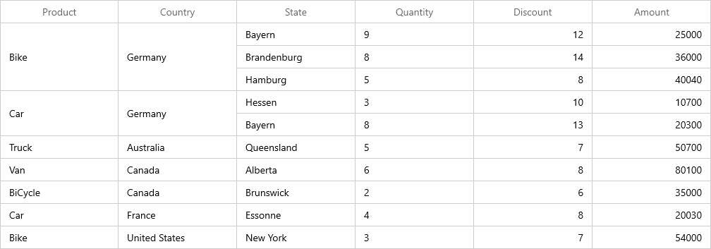

# How to merge the cells based on its content and value of a specific column in WinUI DataGrid?

## About the sample

This example describes how to merge the cells based on its content and value of a specific column in WinUI DataGrid.

[WinUI DataGrid](https://www.syncfusion.com/winui-controls/datagrid) (SfDataGrid) allows to merge the cells based on the content and value of a specific column in the same row by customizing the **GetRange** method and [QueryCoveredRange](https://help.syncfusion.com/cr/winui/Syncfusion.UI.Xaml.DataGrid.SfDataGrid.html#Syncfusion_UI_Xaml_DataGrid_SfDataGrid_QueryCoveredRange) event in DataGrid.

``` C#

this.sfDataGrid.ItemsSourceChanged += OnItemsSourceChanged;
this.sfDataGrid.QueryCoveredRange += OnQueryCoveredRange;

/// <summary>
/// Reflector for SfDataGrid’s data.
/// </summary>
IPropertyAccessProvider reflector = null;

/// <summary>
/// ItemsSourceChanged event handler.
/// </summary>
private void OnItemsSourceChanged(object sender, GridItemsSourceChangedEventArgs e)
{
    if (sfDataGrid.View != null)
        reflector = sfDataGrid.View.GetPropertyAccessProvider();
    else
        reflector = null;
}

/// <summary>
/// QueryCoveredRange event handler
/// </summary>
private void OnQueryCoveredRange(object sender, GridQueryCoveredRangeEventArgs e)
{
    CoveredCellInfo range = null;

    ////here apply merge the cell based on Columns
    if (e.GridColumn.MappingName == "Product" || e.GridColumn.MappingName == "Country")
        range = GetRange(e.GridColumn, e.RowColumnIndex.RowIndex, e.RowColumnIndex.ColumnIndex, e.Record);

    if (range == null)
        return;

    // You can know that the range is already exist in Covered Cells by IsInRange method.
    if (!sfDataGrid.CoveredCells.IsInRange(range))
    {
        e.Range = range;
        e.Handled = true;
    }

    //If the calculated range is already exist in CoveredCells, you can get the range using SfDataGrid.GetConflictRange (CoveredCellInfo coveredCellInfo) extension method.
}

/// <summary>
/// Method to get the covered range based on cell value.
/// </summary>
/// <param name="column"></param>
/// <param name="rowIndex"></param>
/// <param name="columnIndex"></param>
/// <param name="rowData"></param>
/// <returns> Compares the adjacent cell value and returns the range </returns>
/// <remark> If the method find that the adjacent values are equal by horizontal then it will merge vertically. And vice versa</remarks>
 private CoveredCellInfo GetRange(GridColumn column, int rowIndex, int columnIndex, object rowData)
 {
     var range = new CoveredCellInfo(columnIndex, columnIndex, rowIndex, rowIndex);
     object data = reflector.GetFormattedValue(rowData, column.MappingName);

     //here get the Product value for checking other cell value
     string productData = (rowData as ProductSalesDetails).Product;

     GridColumn leftColumn = null;
     GridColumn rightColumn = null;

     // total rows count.
     int recordsCount = this.sfDataGrid.GroupColumnDescriptions.Count != 0 ?
     (this.sfDataGrid.View.TopLevelGroup.DisplayElements.Count + this.sfDataGrid.TableSummaryRows.Count + this.sfDataGrid.UnboundRows.Count + (this.sfDataGrid.AddNewRowPosition == AddNewRowPosition.Top ? +1 : 0)) :
     (this.sfDataGrid.View.Records.Count + this.sfDataGrid.TableSummaryRows.Count + this.sfDataGrid.UnboundRows.Count + (this.sfDataGrid.AddNewRowPosition == AddNewRowPosition.Top ? +1 : 0));

     // Merge Horizontally

     // compare right column
     for (int i = sfDataGrid.Columns.IndexOf(column); i < this.sfDataGrid.Columns.Count - 1; i++)
     {
         var compareData = reflector.GetFormattedValue(rowData, sfDataGrid.Columns[i + 1].MappingName);

         if (compareData == null)
             break;

         if (!compareData.Equals(data))
             break;
         rightColumn = sfDataGrid.Columns[i + 1];
     }

     // compare left column.
     for (int i = sfDataGrid.Columns.IndexOf(column); i > 0; i--)
     {
         var compareData = reflector.GetFormattedValue(rowData, sfDataGrid.Columns[i - 1].MappingName);

         if (compareData == null)
             break;

         if (!compareData.Equals(data))
             break;
         leftColumn = sfDataGrid.Columns[i - 1];
     }

     if (leftColumn != null || rightColumn != null)
     {

         // set left index
         if (leftColumn != null)
         {
             var leftColumnIndex = this.sfDataGrid.ResolveToScrollColumnIndex(this.sfDataGrid.Columns.IndexOf(leftColumn));
             range = new CoveredCellInfo(leftColumnIndex, range.Right, range.Top, range.Bottom);
         }

         // set right index
         if (rightColumn != null)
         {
             var rightColumnIndex = this.sfDataGrid.ResolveToScrollColumnIndex(this.sfDataGrid.Columns.IndexOf(rightColumn));
             range = new CoveredCellInfo(range.Left, rightColumnIndex, range.Top, range.Bottom);
         }
         return range;
     }

     // Merge Vertically from the row index.
     int previousRowIndex = -1;
     int nextRowIndex = -1;
     object previousData = null;

     // Get previous row data.
     var startIndex = sfDataGrid.ResolveStartIndexBasedOnPosition();

     for (int i = rowIndex - 1; i >= startIndex; i--)
     {
         var recordIndex = this.sfDataGrid.ResolveToRecordIndex(i);
         if (this.sfDataGrid.View.GroupDescriptions.Count > 0)
         {
             previousData = this.sfDataGrid.View.TopLevelGroup.DisplayElements[recordIndex];
         }
         else
         {
             var recordCount = this.sfDataGrid.View.Records.Count;
             previousData = (recordCount > 0 && recordIndex >= 0 && recordIndex < recordCount)
                        ? sfDataGrid.View.Records[recordIndex]
                        : null;
         }

         if (previousData == null || !(previousData as NodeEntry).IsRecords)
             break;
         var compareData = reflector.GetFormattedValue((previousData as RecordEntry).Data, column.MappingName);

         //get the previous row data value of Product
         string productPreviousData = ((previousData as RecordEntry).Data as ProductSalesDetails).Product;

         if (compareData == null)
             break;

         if (!compareData.Equals(data))
             break;

         //here check the value
         if (!productData.Equals(productPreviousData))
             break;

         previousRowIndex = i;
     }

     // get next row data.
     object nextData = null;
     for (int i = rowIndex + 1; i < recordsCount + 1; i++)
     {
         var recordIndex = this.sfDataGrid.ResolveToRecordIndex(i);
         if (this.sfDataGrid.View.GroupDescriptions.Count > 0)
         {
             nextData = this.sfDataGrid.View.TopLevelGroup.DisplayElements[recordIndex];
         }
         else
         {
             var recordCount = this.sfDataGrid.View.Records.Count;
             nextData = (recordCount > 0 && recordIndex >= 0 && recordIndex < recordCount)
                        ? sfDataGrid.View.Records[recordIndex]
                        : null;
         }

         if (nextData == null || !(nextData as NodeEntry).IsRecords)
             break;
         var compareData = reflector.GetFormattedValue((nextData as RecordEntry).Data, column.MappingName);

         //get the next row data value of Product
         string productNextData = ((nextData as RecordEntry).Data as ProductSalesDetails).Product;

         if (compareData == null)
             break;

         if (!compareData.Equals(data))
             break;

         //here check the value
         if (!productData.Equals(productNextData))
             break;

         nextRowIndex = i;
     }

     if (previousRowIndex != -1 || nextRowIndex != -1)
     {

         if (previousRowIndex != -1)
             range = new CoveredCellInfo(range.Left, range.Right, previousRowIndex, range.Bottom);

         if (nextRowIndex != -1)
             range = new CoveredCellInfo(range.Left, range.Right, range.Top, nextRowIndex);
         return range;
     }
     return null;
 }
```

The following screenshot shows the merged cells in DataGrid,



Take a moment to peruse the [WinUI DataGrid - Merge Cells](https://help.syncfusion.com/winui/datagrid/merge-cells) documentation, where you can find about merge Cells with code examples.

## Requirements to run the demo
Visual Studio 2019 and above versions
